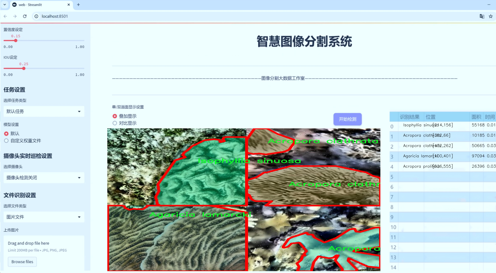
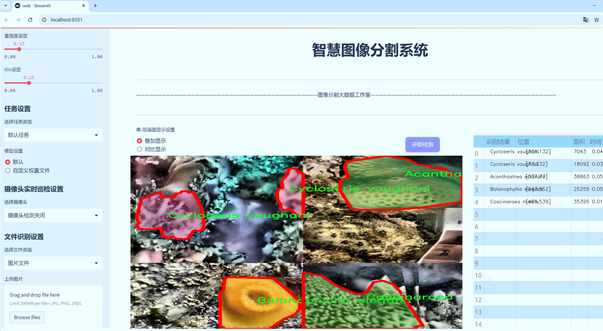
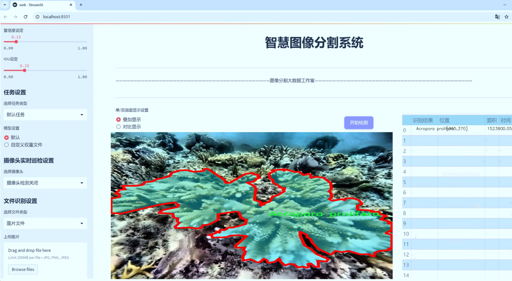
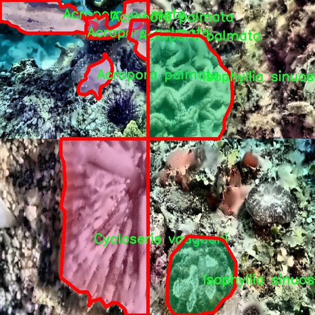
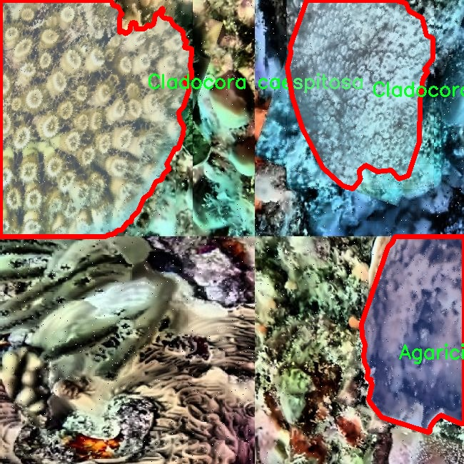
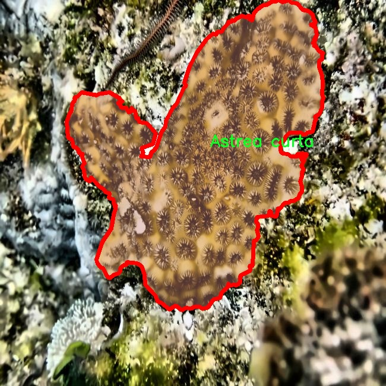
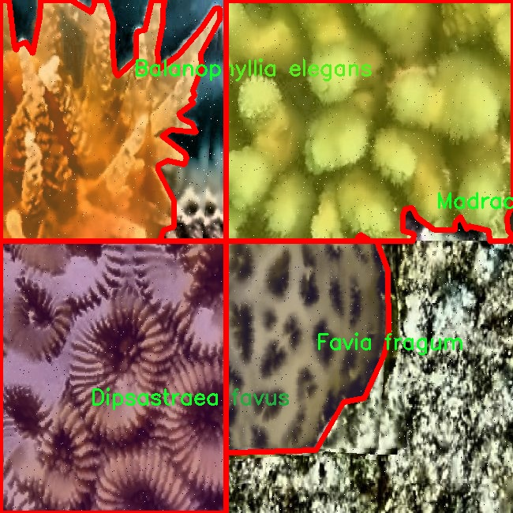
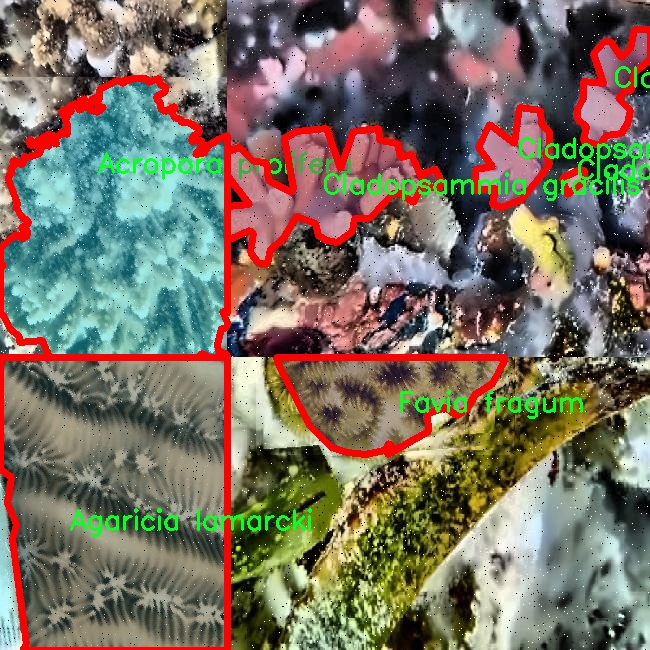

# 珊瑚及鱼类图像分割系统： yolov8-seg-goldyolo

### 1.研究背景与意义

[参考博客](https://gitee.com/YOLOv8_YOLOv11_Segmentation_Studio/projects)

[博客来源](https://kdocs.cn/l/cszuIiCKVNis)

研究背景与意义

随着全球气候变化和人类活动的加剧，海洋生态系统面临着前所未有的威胁，尤其是珊瑚礁和鱼类的生存环境正在迅速恶化。珊瑚礁不仅是海洋生物多样性的关键组成部分，也是许多海洋生物的栖息地和繁殖场所。根据联合国环境规划署的报告，全球约有30%的珊瑚礁已经处于严重退化状态，保护和恢复这些生态系统已成为全球关注的重点。因此，开发有效的监测和保护手段，尤其是利用计算机视觉技术进行珊瑚及鱼类的图像分割，将为生态保护提供新的思路和方法。

在这一背景下，基于改进YOLOv8的珊瑚及鱼类图像分割系统的研究显得尤为重要。YOLO（You Only Look Once）系列模型因其高效的实时目标检测能力而广泛应用于各类计算机视觉任务。YOLOv8作为该系列的最新版本，具有更强的特征提取能力和更高的检测精度，适合处理复杂的海洋图像数据。通过对YOLOv8进行改进，结合珊瑚和鱼类的特征，可以实现对这些生物的高效分割和识别，从而为海洋生态监测提供技术支持。

本研究所使用的数据集“Coral Net”包含1600幅图像，涵盖34个类别的珊瑚和鱼类，涵盖了多种珊瑚物种和鱼类的多样性。这一数据集的丰富性为模型的训练和评估提供了坚实的基础。通过对这些图像进行实例分割，不仅可以提高对珊瑚和鱼类的识别精度，还可以为后续的生态监测和保护措施提供数据支持。例如，精确的图像分割可以帮助研究人员快速评估珊瑚礁的健康状况，识别受损区域，并制定相应的保护策略。

此外，基于改进YOLOv8的图像分割系统还具有广泛的应用前景。除了在生态监测中的应用外，该系统还可以用于海洋生物的研究、环境保护政策的制定以及公众教育等多个领域。通过对珊瑚和鱼类的实时监测，能够提高公众对海洋生态保护的意识，促进可持续发展目标的实现。

综上所述，基于改进YOLOv8的珊瑚及鱼类图像分割系统的研究不仅具有重要的学术价值，也为实际的生态保护工作提供了切实可行的技术手段。随着研究的深入，期待能够为全球海洋生态系统的保护和恢复贡献一份力量。

### 2.图片演示







注意：本项目提供完整的训练源码数据集和训练教程,由于此博客编辑较早,暂不提供权重文件（best.pt）,需要按照6.训练教程进行训练后实现上图效果。

### 3.视频演示

[3.1 视频演示](https://www.bilibili.com/video/BV1JBBsYBE3c/)

### 4.数据集信息

##### 4.1 数据集类别数＆类别名

nc: 30
names: ['Acanthastrea echinata', 'Acropora cervicornis', 'Acropora clathrata', 'Acropora palmata', 'Acropora prolifera', 'Agaricia fragilis', 'Agaricia lamarcki', 'Astrea curta', 'Balanophyllia elegans', 'Blastomussa omanensis', 'Cladocora arbuscula', 'Cladocora caespitosa', 'Cladopsammia gracilis', 'Coscinaraea monile', 'Culicia tenella', 'Cycloseris mokai', 'Cycloseris vaughani', 'Dendrogyra cylindrus', 'Dichocoenia stokesi', 'Diploastrea heliopora', 'Dipsastraea favus', 'Dipsastraea pallida', 'Favia fragum', 'Goniastrea stelligera', 'Goniopora lobata', 'Isophyllia rigida', 'Isophyllia sinuosa', 'Madracis auretenra', 'Madracis decactis', 'Montipora capitata']


##### 4.2 数据集信息简介

数据集信息展示

在当前的生态保护与生物多样性研究中，珊瑚礁的健康状况及其生态系统的完整性日益受到关注。为了推动这一领域的研究，特别是在图像分割技术的应用上，我们使用了名为“Coral Net”的数据集，该数据集专门用于训练改进YOLOv8-seg的珊瑚及鱼类图像分割系统。该数据集包含30个不同的类别，涵盖了多种珊瑚物种，为深度学习模型提供了丰富的训练样本。

“Coral Net”数据集的类别包括了多种重要的珊瑚物种，例如“Acanthastrea echinata”、“Acropora cervicornis”、“Acropora palmata”等。这些物种在珊瑚礁生态系统中扮演着至关重要的角色，它们不仅为海洋生物提供栖息地，还在维护生态平衡方面发挥着重要作用。通过对这些物种的图像进行精确分割，研究人员能够更好地理解它们的分布情况、健康状态以及对环境变化的响应。

在数据集的构建过程中，图像采集涵盖了不同的地理位置和环境条件，确保了数据的多样性和代表性。这些图像不仅展示了珊瑚的外观特征，还考虑了不同光照、深度和水质条件下的表现，使得模型在训练时能够学习到更为复杂的特征。每个类别的图像都经过精细标注，确保了分割任务的准确性和有效性。这种高质量的标注对于训练深度学习模型至关重要，因为它直接影响到模型的性能和最终的应用效果。

在训练过程中，YOLOv8-seg模型将利用“Coral Net”数据集中的图像及其对应的标注信息，进行多轮迭代学习。通过这种方式，模型能够逐步提高对不同珊瑚物种的识别能力和分割精度。值得注意的是，随着模型的不断优化，预计将能实现对珊瑚及其栖息环境的实时监测，这对于生态保护工作具有重要的现实意义。

此外，数据集中的鱼类图像也为模型的训练提供了丰富的背景信息。鱼类与珊瑚的相互作用是生态系统健康的重要指标，通过分析鱼类的分布和种类，研究人员可以进一步了解珊瑚礁的生态动态。这种综合性的研究方法将为未来的海洋保护政策提供科学依据。

总之，“Coral Net”数据集不仅为改进YOLOv8-seg的珊瑚及鱼类图像分割系统提供了必要的基础数据，还为生态学研究提供了宝贵的资源。通过对该数据集的深入分析与应用，研究人员能够更好地理解珊瑚礁生态系统的复杂性，并为其保护与恢复提供有效的技术支持。随着数据集的不断扩展和模型的持续优化，未来在珊瑚礁保护领域的研究将会迎来新的机遇与挑战。











### 5.项目依赖环境部署教程（零基础手把手教学）

[5.1 环境部署教程链接（零基础手把手教学）](https://www.bilibili.com/video/BV1jG4Ve4E9t/?vd_source=bc9aec86d164b67a7004b996143742dc)


[5.2 安装Python虚拟环境创建和依赖库安装视频教程链接（零基础手把手教学）](https://www.bilibili.com/video/BV1nA4VeYEze/?vd_source=bc9aec86d164b67a7004b996143742dc)

### 6.手把手YOLOV8-seg训练视频教程（零基础手把手教学）

[6.1 手把手YOLOV8-seg训练视频教程（零基础小白有手就能学会）](https://www.bilibili.com/video/BV1cA4VeYETe/?vd_source=bc9aec86d164b67a7004b996143742dc)


按照上面的训练视频教程链接加载项目提供的数据集，运行train.py即可开始训练



     Epoch   gpu_mem       box       obj       cls    labels  img_size
     1/200     0G   0.01576   0.01955  0.007536        22      1280: 100%|██████████| 849/849 [14:42<00:00,  1.04s/it]
               Class     Images     Labels          P          R     mAP@.5 mAP@.5:.95: 100%|██████████| 213/213 [01:14<00:00,  2.87it/s]
                 all       3395      17314      0.994      0.957      0.0957      0.0843

     Epoch   gpu_mem       box       obj       cls    labels  img_size
     2/200     0G   0.01578   0.01923  0.007006        22      1280: 100%|██████████| 849/849 [14:44<00:00,  1.04s/it]
               Class     Images     Labels          P          R     mAP@.5 mAP@.5:.95: 100%|██████████| 213/213 [01:12<00:00,  2.95it/s]
                 all       3395      17314      0.996      0.956      0.0957      0.0845

     Epoch   gpu_mem       box       obj       cls    labels  img_size
     3/200     0G   0.01561    0.0191  0.006895        27      1280: 100%|██████████| 849/849 [10:56<00:00,  1.29it/s]
               Class     Images     Labels          P          R     mAP@.5 mAP@.5:.95: 100%|███████   | 187/213 [00:52<00:00,  4.04it/s]
                 all       3395      17314      0.996      0.957      0.0957      0.0845


### 7.50+种全套YOLOV8-seg创新点加载调参实验视频教程（一键加载写好的改进模型的配置文件）

[7.1 50+种全套YOLOV8-seg创新点加载调参实验视频教程（一键加载写好的改进模型的配置文件）](https://www.bilibili.com/video/BV1Hw4VePEXv/?vd_source=bc9aec86d164b67a7004b996143742dc)

### YOLOV8-seg算法简介

原始YOLOv8-seg算法原理

YOLOv8-seg算法是YOLO系列目标检测算法的最新迭代，旨在进一步提升目标检测和分割的性能。该算法由Glenn-Jocher提出，延续了YOLOv3和YOLOv5的设计理念，并在此基础上进行了多项创新和改进。YOLOv8-seg不仅关注目标的检测，还在目标分割任务中展现出卓越的能力，使其在复杂场景下的应用更加广泛。

首先，YOLOv8-seg在数据预处理方面延续了YOLOv5的策略，采用了多种数据增强技术以提高模型的鲁棒性和泛化能力。这些增强手段包括马赛克增强、混合增强、空间扰动和颜色扰动等。马赛克增强通过将多张图像拼接在一起，生成新的训练样本，帮助模型更好地适应不同的场景和物体特征；混合增强则通过将两张图像进行加权融合，进一步丰富了训练数据的多样性；空间扰动和颜色扰动则分别通过对图像进行随机变换和颜色调整，增强了模型对图像变换的适应能力。这些数据预处理技术的结合，使得YOLOv8-seg在训练过程中能够获得更为丰富的特征信息，从而提升模型的检测和分割性能。

在骨干网络结构方面，YOLOv8-seg对YOLOv5的设计进行了改进，采用了新的C2f模块替代了原有的C3模块。C2f模块的设计理念是通过引入更多的分支来丰富梯度回传时的支流，从而提高特征提取的效率和效果。每个C2f模块将输入特征图分为多个分支，每个分支经过卷积层进行特征处理，最终将各个分支的输出进行融合。这种设计不仅增强了特征图的表达能力，还提升了模型的学习能力，使得YOLOv8-seg在处理复杂场景时能够更好地捕捉到目标的细节信息。

YOLOv8-seg依然采用了FPN-PAN结构来构建特征金字塔，确保多尺度信息之间的充分融合。FPN（特征金字塔网络）和PAN（路径聚合网络）的结合，使得模型能够在不同尺度上有效地提取特征，并将其整合到最终的检测和分割结果中。与YOLOv5相比，YOLOv8-seg在FPN-PAN结构中将C3模块替换为C2f模块，进一步提升了特征融合的效果。这种结构的设计使得YOLOv8-seg在处理多尺度目标时，能够更好地平衡不同尺度特征之间的影响，从而提高检测和分割的准确性。

在检测头的设计上，YOLOv8-seg采用了解耦头结构，将分类和定位任务分开处理。这种解耦合的设计理念使得模型能够更加专注于每个任务的特征提取，从而提高了整体的检测性能。与传统的耦合头结构相比，解耦头结构能够更好地适应复杂的目标分布和多样的场景变化，提升了模型在实际应用中的表现。此外，YOLOv8-seg采用了无锚框（Anchor-Free）的检测方式，直接预测目标的中心点和宽高比例，进一步减少了对Anchor框的依赖，提高了检测速度和准确度。

在标签分配策略方面，YOLOv8-seg引入了TOOD（Task-Oriented Object Detection）策略，动态地分配标签以优化正负样本的匹配。这种策略的设计考虑到了数据集的多样性和复杂性，能够更好地适应不同场景下的目标分布。与YOLOX所采用的SimOTA策略不同，YOLOv8-seg的TOOD策略在标签分配过程中仅使用目标框和目标分数，简化了计算过程，并提高了训练效率。YOLOv8-seg的损失函数设计也经过了优化，分类损失采用了Varifocal Loss（VFL），回归损失则结合了CIoULoss和DFLLoss。这种损失函数的设计使得模型在训练过程中能够更加关注高质量的正样本，同时降低负样本对损失的影响，从而提高了模型的学习效果。

总的来说，YOLOv8-seg算法通过对数据预处理、骨干网络结构、特征融合、检测头设计和标签分配策略等多个方面的改进，提升了目标检测和分割的性能。其创新的C2f模块、解耦头结构以及动态标签分配策略，使得YOLOv8-seg在处理复杂场景和多样目标时，展现出更高的准确性和效率。这些改进不仅为YOLO系列算法的发展提供了新的思路，也为实际应用中的目标检测和分割任务奠定了坚实的基础。随着YOLOv8-seg的推广和应用，预计将在智能监控、自动驾驶、无人机视觉等领域发挥重要作用。


### 9.系统功能展示（检测对象为举例，实际内容以本项目数据集为准）

图9.1.系统支持检测结果表格显示

  图9.2.系统支持置信度和IOU阈值手动调节

  图9.3.系统支持自定义加载权重文件best.pt(需要你通过步骤5中训练获得)

  图9.4.系统支持摄像头实时识别

  图9.5.系统支持图片识别

  图9.6.系统支持视频识别

  图9.7.系统支持识别结果文件自动保存

  图9.8.系统支持Excel导出检测结果数据


### 10.50+种全套YOLOV8-seg创新点原理讲解（非科班也可以轻松写刊发刊，V11版本正在科研待更新）

#### 10.1 由于篇幅限制，每个创新点的具体原理讲解就不一一展开，具体见下列网址中的创新点对应子项目的技术原理博客网址【Blog】：


[10.1 50+种全套YOLOV8-seg创新点原理讲解链接](https://gitee.com/qunmasj/good)

#### 10.2 部分改进模块原理讲解(完整的改进原理见上图和技术博客链接)【如果此小节的图加载失败可以通过CSDN或者Github搜索该博客的标题访问原始博客，原始博客图片显示正常】
### YOLOv8简介
YOLOv8目标检测算法继承了YOLOv1系列的思考,是一种新型端到端的目标检测算法,尽管现在原始检测算法已经开源,但是鲜有发表的相关论文.YOLOv8的网络结构如图所示,主要可分为Input输入端、Backbone骨干神经网络、Neck 混合特征网络层和Head预测层网络共4个部分.

YOLO目标检测算法是一种端到端的One-Slage 目标检测算法，其核心思想是将图像按区域分块进行预测。YOLO将输入图像按照32x32的大小划分成若干个网格，例如416x416的图像将被划分为13x13个网格。当目标物体的中心位于某个网格内时,该网格就会负责输出该物体的边界框和类别置信度。每个网格可以预测多个边界框和多个目标类别,这些边界框和类别的数量可以根据需要进行设置。YOLO算法的输出是一个特征图,包含了每个网格对应的边界框和类别置信度的信息呵。本文采用YOLO最新的YOLOv8模型，其是2022年底发布的最新YOLO系列模型，采用全新的SOTA模型，全新的网络主干结构,如图1所示。
整个网络分为Backbone 骨干网络部分和Head头部网络部分。YOLOv8汲取了前几代网络的优秀特性，骨干网络和 Neck部分遵循CSP的思想，将YOLOv5中的C3模块被替换成了梯度流更丰富C2模块,去掉YOLOv5中 PAN-FPN上采样阶段中的卷积结构,将Backbone不同阶段输出的特征直接送入了上采样操作,模型提供了N/S/M/L/X尺度的不同大小模型,能够满足不同领域业界的需求。本文基于YOLOv8模型设计番茄病虫害检测系统，通过配置模型参数训练番茄图像,得到能够用于部署应用的最优模型。


### 感受野注意力卷积（RFAConv)
#### 标准卷积操作回顾
标准的卷积操作是构造卷积神经网络的基本构件。它利用具有共享参数的滑动窗口提取特征信息，克服了全连通层构造神经网络固有的参数多、计算开销大的问题。设 X R∈C×H×W
表示输入特征图，其中C、H、W分别表示特征图的通道数、高度、宽度。为了清楚地演示卷积核的特征提取过程，我们使用 C = 1 的例子。从每个接受域滑块中提取特征信息的卷积运算可以表示为:


这里，Fi 表示计算后每个卷积滑块得到的值，Xi 表示每个滑块内对应位置的像素值，K表示卷积核，S表示卷积核中的参数个数，N表示接收域滑块的总数。可以看出，每个滑块内相同位置的 feature共享相同的参数Ki。因此，标准的卷积运算并不能捕捉到不同位置所带来的信息差异，这最终在一定程度上限制了卷积神经网络的性能。 

#### 空间注意力回顾
目前，空间注意机制是利用学习得到的注意图来突出每个特征的重要性。与前一节类似，这里以 C=1为例。突出关键特征的空间注意机制可以简单表述为:这里，Fi 表示加权运算后得到的值。xi 和Ai 表示输入特征图和学习到的注意图在不同位置的值，N为输入特征图的高和宽的乘积，表示像素值的总数。


#### 空间注意与标准卷积运算
将注意力机制整合到卷积神经网络中，可以提高卷积神经网络的性能。通过对标准卷积运算和现有空间注意机制的研究，我们认为空间注意机制有效地克服了卷积神经网络固有的参数共享的局限性。目前卷积神经网络中最常用的核大小是 1 × 1和3 × 3。在引入空间注意机制后，提取特征的卷积操作可以是 1 × 1或3 × 3卷积操作。为了直观地展示这个过程，在 1 × 1卷积运算的前面插入了空间注意机制。通过注意图对输入特征图(Re-weight“×”)进行加权运算，最后通过 1 × 1卷积运算提取接收域的滑块特征信息。整个过程可以简单地表示如下:


 这里卷积核K仅代表一个参数值。如果取A i× ki 的值作为一种新的卷积核参数，有趣的是它解决了 1×1卷积运算提取特征时的参数共享问题。然而，关于空间注意机制的传说到此结束。当空间注意机制被插入到3×3卷积运算前面时。具体情况如下:


如上所述，如果取A的值 i × ki (4)式作为一种新的卷积核参数，完全解决了大规模卷积核的参数共享问题。然而，最重要的一点是，卷积核在提取每个接受域滑块的特征时，会共享一些特征。换句话说，每个接收域滑块内都有一个重叠。仔细分析后会发现A12= a21， a13 = a22， a15 = a24……，在这种情况下，每个滑动窗口共享空间注意力地图的权重。因此，空间注意机制没有考虑整个接受域的空间特征，不能有效地解决大规模卷积核的参数共享问题。因此，空间注意机制的有效性受到限制。 

#### 创新空间注意力和标准卷积操作
该博客提出解决了现有空间注意机制的局限性，为空间处理提供了一种创新的解决方案。受RFA的启发，一系列空间注意机制被开发出来，可以进一步提高卷积神经网络的性能。RFA可以看作是一个轻量级即插即用模块，RFA设计的卷积运算(RFAConv)可以代替标准卷积来提高卷积神经网络的性能。因此，我们预测空间注意机制与标准卷积运算的结合将继续发展，并在未来带来新的突破。
接受域空间特征:为了更好地理解接受域空间特征的概念，我们将提供相关的定义。接收域空间特征是专门为卷积核设计的，并根据核大小动态生成。如图1所示，以3×3卷积核为例。在图1中，“Spatial Feature”指的是原始的Feature map。“接受域空间特征”是空间特征变换后的特征图。

 

由不重叠的滑动窗口组成。当使用 3×3卷积内核提取特征时，接收域空间特征中的每个 3×3大小窗口代表一个接收域滑块。接受域注意卷积(RFAConv):针对接受域的空间特征，我们提出了接受域注意卷积(RFA)。该方法不仅强调了接收域滑块内不同特征的重要性，而且对接收域空间特征进行了优先排序。通过该方法，完全解决了卷积核参数共享的问题。接受域空间特征是根据卷积核的大小动态生成的，因此，RFA是卷积的固定组合，不能与卷积操作的帮助分离，卷积操作同时依赖于RFA来提高性能，因此我们提出了接受场注意卷积(RFAConv)。具有3×3大小的卷积核的RFAConv整体结构如图所示。


目前，最广泛使用的接受域特征提取方法是缓慢的。经过大量的研究，我们开发了一种快速的方法，用分组卷积来代替原来的方法。具体来说，我们利用相应大小的分组卷积来动态生成基于接受域大小的展开特征。尽管与原始的无参数方法(如PyTorch提供的nn.())相比，该方法增加了一些参数，但它的速度要快得多。注意:如前一节所述，当使用 3×3卷积内核提取特征时，接收域空间特征中的每个 3×3大小窗口表示一个接收域滑块。而利用快速分组卷积提取感受野特征后，将原始特征映射为新的特征。最近的研究表明。交互信息可以提高网络性能，如[40,41,42]所示。同样，对于RFAConv来说，通过交互接受域特征信息来学习注意图可以提高网络性能。然而，与每个接收域特征交互会导致额外的计算开销，因此为了最小化计算开销和参数的数量，我们使用AvgPool来聚合每个接收域特征的全局信息。然后，使用 1×1 组卷积操作进行信息交互。最后，我们使用softmax来强调每个特征在接受域特征中的重要性。一般情况下，RFA的计算可以表示为:


这里gi×i 表示一个大小为 i×i的分组卷积，k表示卷积核的大小，Norm表示归一化，X表示输入的特征图，F由注意图 a相乘得到 rf 与转换后的接受域空间特征 Frf。与CBAM和CA不同，RFA能够为每个接受域特征生成注意图。卷积神经网络的性能受到标准卷积操作的限制，因为卷积操作依赖于共享参数，对位置变化带来的信息差异不敏感。然而，RFAConv通过强调接收域滑块中不同特征的重要性，并对接收域空间特征进行优先级排序，可以完全解决这个问题。通过RFA得到的feature map是接受域空间特征，在“Adjust Shape”后没有重叠。因此，学习到的注意图将每个接受域滑块的特征信息聚合起来。换句话说，注意力地图不再共享在每个接受域滑块。这完全弥补了现有 CA和CBAM注意机制的不足。RFA为标准卷积内核提供了显著的好处。而在调整形状后，特征的高度和宽度是 k倍，需要进行 stride = k的k × k卷积运算来提取特征信息。RFA设计的卷积运算RFAConv为卷积带来了良好的增益，对标准卷积进行了创新。
此外，我们认为现有的空间注意机制应该优先考虑接受域空间特征，以提高网络性能。众所周知，基于自注意机制的网络模型[43,44,45]取得了很大的成功，因为它解决了卷积参数共享的问题，并对远程信息进行建模。然而，自注意机制也为模型引入了显著的计算开销和复杂性。我们认为，将现有的空间注意机制的注意力引导到接受场空间特征上，可以以类似于自我注意的方式解决长期信息的参数共享和建模问题。与自我关注相比，这种方法需要的参数和计算资源少得多。答案如下:(1)将以接收场空间特征为中心的空间注意机制与卷积相结合，消除了卷积参数共享的问题。(2)现有的空间注意机制已经考虑了远程信息，可以通过全局平均池或全局最大池的方式获取全局信息，其中明确考虑了远程信息。因此，我们设计了新的 CBAM和CA模型，称为RFCBAM和RFCA，它们专注于接受域空间特征。与RFA类似，使用最终的k × k stride = k 的卷积运算来提取特征信息。这两种新的卷积方法的具体结构如图 3所示，我们称这两种新的卷积操作为 RFCBAMConv和RFCAConv。与原来的CBAM相比，我们在RFCBAM中使用SE attention来代替CAM。因为这样可以减少计算开销。此外，在RFCBAM中，通道注意和空间注意不是分开执行的。相反，它们是同时加权的，使得每个通道获得的注意力地图是不同的。


### 11.项目核心源码讲解（再也不用担心看不懂代码逻辑）

#### 11.1 ultralytics\models\rtdetr\__init__.py

以下是对给定代码的核心部分进行分析和详细注释的结果：

```python
# Ultralytics YOLO 🚀, AGPL-3.0 license

# 从当前包中导入 RTDETR 模型类
from .model import RTDETR

# 从当前包中导入 RTDETR 预测器类
from .predict import RTDETRPredictor

# 从当前包中导入 RTDETR 验证器类
from .val import RTDETRValidator

# 定义模块的公开接口，包含 RTDETR 模型、预测器和验证器
__all__ = 'RTDETRPredictor', 'RTDETRValidator', 'RTDETR'
```

### 代码分析

1. **导入模块**：
   - `from .model import RTDETR`：导入 RTDETR 模型类，这个类通常用于定义和构建目标检测模型的结构。
   - `from .predict import RTDETRPredictor`：导入 RTDETR 预测器类，该类负责使用模型进行推理和预测，通常会处理输入数据并返回检测结果。
   - `from .val import RTDETRValidator`：导入 RTDETR 验证器类，该类用于验证模型的性能，通常包括评估指标的计算和结果的可视化。

2. **模块公开接口**：
   - `__all__ = 'RTDETRPredictor', 'RTDETRValidator', 'RTDETR'`：定义了模块的公开接口，只有在使用 `from module import *` 时，这些名称会被导入。这有助于控制模块的可见性，避免不必要的名称污染。

### 结论
以上代码是一个模块的初始化文件，主要负责导入和暴露模型、预测器和验证器的核心功能。通过这种方式，用户可以方便地使用这些类进行目标检测任务。

这个文件是一个Python模块的初始化文件，位于Ultralytics YOLO项目的RTDETR子模块中。它的主要作用是定义该模块的公共接口，并导入其他相关的类或函数，以便在使用该模块时能够方便地访问。

首先，文件开头有一行注释，表明这是Ultralytics YOLO项目的一部分，并且该项目遵循AGPL-3.0许可证。这种许可证允许用户自由使用、修改和分发软件，但要求在分发时保持相同的许可证。

接下来，文件通过相对导入的方式引入了三个组件：`RTDETR`、`RTDETRPredictor`和`RTDETRValidator`。这些组件分别来自于该模块下的`model.py`、`predict.py`和`val.py`文件。`RTDETR`可能是一个模型类，负责定义和构建RTDETR模型；`RTDETRPredictor`可能是一个预测类，用于对输入数据进行推理和预测；而`RTDETRValidator`则可能是一个验证类，用于评估模型的性能。

最后，`__all__`变量定义了该模块的公共接口，即当使用`from ultralytics.models.rtdetr import *`语句时，只有在`__all__`中列出的名称会被导入。这有助于控制模块的可见性，避免不必要的内部实现细节被暴露给用户。

总的来说，这个初始化文件的主要功能是整合和暴露RTDETR模块的核心功能，使得用户在使用时更加方便。

#### 11.2 ultralytics\models\yolo\pose\predict.py

以下是代码中最核心的部分，并附上详细的中文注释：

```python
from ultralytics.engine.results import Results  # 导入结果处理类
from ultralytics.models.yolo.detect.predict import DetectionPredictor  # 导入检测预测器基类
from ultralytics.utils import DEFAULT_CFG, LOGGER, ops  # 导入默认配置、日志记录器和操作工具

class PosePredictor(DetectionPredictor):
    """
    PosePredictor类扩展了DetectionPredictor类，用于基于姿态模型的预测。
    """

    def __init__(self, cfg=DEFAULT_CFG, overrides=None, _callbacks=None):
        """初始化PosePredictor，将任务设置为'pose'并记录使用'mps'作为设备的警告。"""
        super().__init__(cfg, overrides, _callbacks)  # 调用父类构造函数
        self.args.task = 'pose'  # 设置任务为姿态预测
        # 检查设备是否为Apple MPS，并发出警告
        if isinstance(self.args.device, str) and self.args.device.lower() == 'mps':
            LOGGER.warning("WARNING ⚠️ Apple MPS known Pose bug. Recommend 'device=cpu' for Pose models. "
                           'See https://github.com/ultralytics/ultralytics/issues/4031.')

    def postprocess(self, preds, img, orig_imgs):
        """返回给定输入图像或图像列表的检测结果。"""
        # 应用非极大值抑制，过滤掉低置信度的预测框
        preds = ops.non_max_suppression(preds,
                                        self.args.conf,  # 置信度阈值
                                        self.args.iou,  # IOU阈值
                                        agnostic=self.args.agnostic_nms,  # 是否类别无关的NMS
                                        max_det=self.args.max_det,  # 最大检测框数量
                                        classes=self.args.classes,  # 选择的类别
                                        nc=len(self.model.names))  # 类别数量

        # 如果输入图像不是列表，则将其转换为numpy数组
        if not isinstance(orig_imgs, list):
            orig_imgs = ops.convert_torch2numpy_batch(orig_imgs)

        results = []  # 初始化结果列表
        for i, pred in enumerate(preds):  # 遍历每个预测结果
            orig_img = orig_imgs[i]  # 获取原始图像
            # 将预测框的坐标缩放到原始图像的尺寸
            pred[:, :4] = ops.scale_boxes(img.shape[2:], pred[:, :4], orig_img.shape).round()
            # 获取关键点预测
            pred_kpts = pred[:, 6:].view(len(pred), *self.model.kpt_shape) if len(pred) else pred[:, 6:]
            # 将关键点坐标缩放到原始图像的尺寸
            pred_kpts = ops.scale_coords(img.shape[2:], pred_kpts, orig_img.shape)
            img_path = self.batch[0][i]  # 获取图像路径
            # 将结果添加到结果列表中
            results.append(
                Results(orig_img, path=img_path, names=self.model.names, boxes=pred[:, :6], keypoints=pred_kpts))
        return results  # 返回检测结果
```

### 代码核心部分说明：
1. **PosePredictor类**：该类继承自`DetectionPredictor`，用于姿态检测的预测。
2. **初始化方法**：设置任务类型为“pose”，并在使用Apple MPS设备时发出警告。
3. **后处理方法**：对模型的预测结果进行后处理，包括非极大值抑制、坐标缩放等，最终返回处理后的结果。

这个程序文件是一个用于姿态预测的类，名为 `PosePredictor`，它继承自 `DetectionPredictor` 类。该类的主要功能是处理输入图像并进行姿态估计。文件中首先导入了一些必要的模块和类，包括 `Results`、`DetectionPredictor` 和一些工具函数。

在 `PosePredictor` 类的构造函数 `__init__` 中，首先调用了父类的构造函数，并将任务类型设置为 'pose'。如果设备被设置为 'mps'（苹果的金属性能着色器），则会发出警告，提示用户可能会遇到已知的姿态模型问题，建议使用 'cpu' 作为设备。

类中还有一个重要的方法 `postprocess`，用于处理模型的预测结果。该方法接收预测结果、输入图像和原始图像作为参数。首先，它使用非极大值抑制（NMS）来过滤掉低置信度的检测结果。接着，如果输入的原始图像不是列表格式，则将其转换为 NumPy 数组格式。

然后，方法会遍历每个预测结果，并对每个图像进行处理。它会调整预测框的坐标，使其适应原始图像的尺寸，并提取关键点信息。最后，将处理后的结果封装为 `Results` 对象，并返回一个结果列表。

这个类的设计使得姿态预测的流程更加清晰，并且通过继承和重用父类的功能，减少了代码的重复性。整体上，这个文件为使用 YOLO 模型进行姿态估计提供了一个有效的实现。

#### 11.3 ultralytics\nn\modules\__init__.py

以下是保留的核心代码部分，并附上详细的中文注释：

```python
# 导入所需的模块
from .block import *  # 导入模块中的所有内容，通常包含网络的基本构建块
from .conv import *   # 导入卷积相关的模块，通常用于构建卷积层
from .head import *   # 导入网络头部模块，通常用于输出层的定义
from .transformer import *  # 导入变换器模块，可能用于特征提取或处理
```

### 注释说明：
1. **模块导入**：
   - `from .block import *`：导入当前包中的 `block` 模块，通常包含构建神经网络的基本组件，例如卷积块、激活函数等。
   - `from .conv import *`：导入 `conv` 模块，主要用于定义卷积层的相关功能和类，卷积层是卷积神经网络（CNN）的核心组成部分。
   - `from .head import *`：导入 `head` 模块，通常定义网络的输出部分，例如分类头或检测头，用于最终的预测。
   - `from .transformer import *`：导入 `transformer` 模块，可能用于实现变换器架构，处理输入特征并进行特征提取。

### 总结：
这段代码的核心功能是导入构建 YOLO（You Only Look Once）模型所需的各个模块，确保可以使用这些模块中的类和函数来构建和训练目标检测模型。

这个程序文件是Ultralytics YOLO项目中的一个模块初始化文件，文件名为`__init__.py`，其主要作用是将该模块中的其他子模块导入，以便于用户可以方便地使用这些功能。

文件开头的注释部分简要介绍了Ultralytics YOLO项目，并说明了该文件的许可证类型为AGPL-3.0。接下来，文件中提供了一个示例，展示了如何使用该模块进行模型可视化。示例代码中，首先从`ultralytics.nn.modules`导入所有内容，然后导入了PyTorch库和操作系统库。接着，创建了一个形状为(1, 128, 40, 40)的张量`x`，并实例化了一个卷积层`m`，其输入和输出通道均为128。之后，代码将该卷积层导出为ONNX格式，并使用`onnxsim`工具对其进行简化，最后打开生成的ONNX文件。

在文件的最后部分，使用了相对导入的方式将其他模块（如`block`、`conv`、`head`和`transformer`）导入到当前模块中。这种结构使得用户在使用`ultralytics.nn.modules`时，可以直接访问这些子模块中的功能，增强了代码的可读性和可维护性。总的来说，这个文件为Ultralytics YOLO的模块化设计提供了一个清晰的入口。

#### 11.4 ultralytics\utils\downloads.py

以下是代码中最核心的部分，并附上详细的中文注释：

```python
import requests
from pathlib import Path
from zipfile import ZipFile, is_zipfile
from tqdm import tqdm  # 进度条库

def safe_download(url, file=None, dir=None, unzip=True, delete=False, retry=3, progress=True):
    """
    从指定的 URL 下载文件，并可选择解压缩和删除下载的文件。

    参数:
        url (str): 要下载的文件的 URL。
        file (str, optional): 下载文件的文件名。如果未提供，将使用 URL 的文件名。
        dir (str, optional): 保存下载文件的目录。如果未提供，将保存在当前工作目录。
        unzip (bool, optional): 是否解压下载的文件。默认值为 True。
        delete (bool, optional): 是否在解压后删除下载的文件。默认值为 False。
        retry (int, optional): 下载失败时重试的次数。默认值为 3。
        progress (bool, optional): 是否在下载过程中显示进度条。默认值为 True。
    """
    # 处理文件名
    f = Path(dir) / (file if file else url.split('/')[-1]) if dir else Path(file)
    
    # 检查文件是否已存在
    if not f.is_file():
        # 创建目录
        f.parent.mkdir(parents=True, exist_ok=True)
        # 下载文件
        for i in range(retry + 1):
            try:
                response = requests.get(url, stream=True)
                response.raise_for_status()  # 检查请求是否成功
                total_size = int(response.headers.get('Content-Length', 0))  # 获取文件总大小
                with open(f, 'wb') as f_opened:
                    for data in tqdm(response.iter_content(chunk_size=1024), total=total_size // 1024, desc=f'Downloading {f.name}', disable=not progress):
                        f_opened.write(data)
                break  # 下载成功，退出循环
            except Exception as e:
                if i == retry:
                    raise ConnectionError(f'下载失败: {url}') from e  # 超过重试次数，抛出异常

    # 解压文件
    if unzip and f.exists() and f.suffix in ('.zip', '.tar', '.gz'):
        unzip_dir = dir or f.parent  # 解压到指定目录或当前目录
        if is_zipfile(f):
            with ZipFile(f, 'r') as zipObj:
                zipObj.extractall(unzip_dir)  # 解压所有文件
        if delete:
            f.unlink()  # 删除下载的文件

    return unzip_dir  # 返回解压目录

# 示例用法
# safe_download('https://example.com/file.zip', dir='downloads', unzip=True, delete=True)
```

### 代码核心部分解释：
1. **导入必要的库**：使用 `requests` 库进行网络请求，`Path` 用于处理文件路径，`ZipFile` 用于解压缩文件，`tqdm` 用于显示下载进度条。

2. **`safe_download` 函数**：该函数实现了从指定 URL 下载文件的功能，并支持解压缩和删除下载的文件。

3. **参数处理**：
   - `url`：要下载的文件的 URL。
   - `file`：下载后保存的文件名。
   - `dir`：指定保存文件的目录。
   - `unzip`：是否在下载后解压缩文件。
   - `delete`：是否在解压后删除下载的文件。
   - `retry`：下载失败时的重试次数。
   - `progress`：是否显示下载进度条。

4. **文件下载逻辑**：
   - 检查文件是否已存在，如果不存在则创建目录并下载文件。
   - 使用 `requests.get` 方法下载文件，并通过 `tqdm` 显示下载进度。
   - 在下载过程中处理异常，如果下载失败则根据重试次数进行重试。

5. **文件解压**：如果下载的文件是压缩文件（如 `.zip`、`.tar`、`.gz`），则进行解压缩，并根据需要删除下载的文件。

6. **返回解压目录**：函数最后返回解压后的目录路径。

这个程序文件`ultralytics/utils/downloads.py`主要用于处理文件的下载、解压和管理，特别是与Ultralytics的YOLO模型相关的资源。文件中包含多个函数，每个函数都有特定的功能，以下是对主要部分的说明。

首先，文件导入了一些必要的库，包括`contextlib`、`re`、`shutil`、`subprocess`、`requests`和`torch`等。这些库提供了处理文件、网络请求和多线程等功能。

文件定义了一些常量，如`GITHUB_ASSETS_REPO`和`GITHUB_ASSETS_NAMES`，这些常量列出了在GitHub上维护的Ultralytics资产的名称，主要是YOLO模型的权重文件。

接下来，`is_url`函数用于检查给定字符串是否为有效的URL，并可选地检查该URL是否存在。`delete_dsstore`函数则用于删除指定目录下的`.DS_Store`文件，这些文件是macOS系统生成的隐藏文件，可能在跨平台文件传输时造成问题。

`zip_directory`和`unzip_file`函数分别用于压缩目录和解压缩文件。`zip_directory`函数会将指定目录中的文件压缩为一个ZIP文件，并支持排除特定文件。`unzip_file`函数则可以将ZIP文件解压到指定路径，并支持排除某些文件。

`check_disk_space`函数用于检查下载文件所需的磁盘空间是否足够。它会计算所需空间和当前可用空间，并根据设置决定是否抛出错误。

`get_google_drive_file_info`函数用于从Google Drive的共享链接中提取直接下载链接和文件名，以便后续下载。

`safe_download`函数是文件下载的核心，支持从URL下载文件，并提供了重试机制、解压缩选项和删除下载文件的选项。它还能够处理Google Drive链接，并根据需要使用`curl`命令进行下载。

`get_github_assets`函数用于从指定的GitHub仓库获取发布版本的信息，包括标签和资产列表。`attempt_download_asset`函数尝试从GitHub下载指定的文件，如果本地不存在该文件。

最后，`download`函数用于处理文件的下载和解压，支持多线程下载。根据传入的参数，它可以选择顺序或并行下载文件。

总体而言，这个文件提供了一系列功能强大的工具，用于处理与YOLO模型相关的文件下载和管理，确保用户能够方便地获取和使用所需的资源。

#### 11.5 ultralytics\utils\dist.py

以下是经过简化和注释的核心代码部分：

```python
import os
import re
import shutil
import socket
import sys
import tempfile
from pathlib import Path

from . import USER_CONFIG_DIR
from .torch_utils import TORCH_1_9

def find_free_network_port() -> int:
    """
    查找本地主机上一个空闲的网络端口。

    在单节点训练时，这个函数非常有用，因为我们不想连接到一个真实的主节点，
    但必须设置 `MASTER_PORT` 环境变量。
    """
    with socket.socket(socket.AF_INET, socket.SOCK_STREAM) as s:
        s.bind(('127.0.0.1', 0))  # 绑定到本地地址和随机端口
        return s.getsockname()[1]  # 返回分配的端口号

def generate_ddp_file(trainer):
    """生成一个 DDP 文件并返回其文件名。"""
    # 获取训练器的模块和类名
    module, name = f'{trainer.__class__.__module__}.{trainer.__class__.__name__}'.rsplit('.', 1)

    # 创建文件内容，包含训练器的参数和训练逻辑
    content = f'''overrides = {vars(trainer.args)} \nif __name__ == "__main__":
    from {module} import {name}
    from ultralytics.utils import DEFAULT_CFG_DICT

    cfg = DEFAULT_CFG_DICT.copy()
    cfg.update(save_dir='')   # 处理额外的 'save_dir' 键
    trainer = {name}(cfg=cfg, overrides=overrides)
    trainer.train()'''
    
    # 创建 DDP 目录（如果不存在）
    (USER_CONFIG_DIR / 'DDP').mkdir(exist_ok=True)
    
    # 创建临时文件并写入内容
    with tempfile.NamedTemporaryFile(prefix='_temp_',
                                     suffix=f'{id(trainer)}.py',
                                     mode='w+',
                                     encoding='utf-8',
                                     dir=USER_CONFIG_DIR / 'DDP',
                                     delete=False) as file:
        file.write(content)  # 写入训练代码
    return file.name  # 返回临时文件名

def generate_ddp_command(world_size, trainer):
    """生成并返回分布式训练的命令。"""
    import __main__  # 本地导入以避免潜在问题
    if not trainer.resume:
        shutil.rmtree(trainer.save_dir)  # 如果不恢复训练，删除保存目录
    
    file = str(Path(sys.argv[0]).resolve())  # 获取当前脚本的绝对路径
    # 定义允许的文件名模式
    safe_pattern = re.compile(r'^[a-zA-Z0-9_. /\\-]{1,128}$')
    
    # 检查文件名是否合法，若不合法则生成 DDP 文件
    if not (safe_pattern.match(file) and Path(file).exists() and file.endswith('.py')):
        file = generate_ddp_file(trainer)
    
    # 根据 PyTorch 版本选择分布式命令
    dist_cmd = 'torch.distributed.run' if TORCH_1_9 else 'torch.distributed.launch'
    port = find_free_network_port()  # 查找空闲端口
    # 构建命令
    cmd = [sys.executable, '-m', dist_cmd, '--nproc_per_node', f'{world_size}', '--master_port', f'{port}', file]
    return cmd, file  # 返回命令和文件名

def ddp_cleanup(trainer, file):
    """如果创建了临时文件，则删除它。"""
    if f'{id(trainer)}.py' in file:  # 检查文件名是否包含临时文件后缀
        os.remove(file)  # 删除临时文件
```

### 代码说明：
1. **查找空闲端口**：`find_free_network_port` 函数用于查找本地主机上一个可用的网络端口，主要用于分布式训练时设置 `MASTER_PORT` 环境变量。
  
2. **生成 DDP 文件**：`generate_ddp_file` 函数创建一个包含训练逻辑的临时 Python 文件，并返回该文件的路径。文件内容包括训练器的参数和训练代码。

3. **生成分布式训练命令**：`generate_ddp_command` 函数根据当前的训练器和世界大小生成用于分布式训练的命令。它会检查当前脚本的合法性，并在必要时生成 DDP 文件。

4. **清理临时文件**：`ddp_cleanup` 函数用于删除生成的临时文件，以避免在训练结束后留下无用的文件。

这个程序文件是用于处理分布式训练相关的功能，主要涉及到生成分布式训练所需的命令和临时文件。文件中包含了一些函数，下面对每个函数的功能进行详细说明。

首先，`find_free_network_port` 函数用于查找本地主机上一个可用的网络端口。这个功能在单节点训练时非常有用，因为我们不想连接到一个真实的主节点，但仍然需要设置 `MASTER_PORT` 环境变量。函数通过创建一个 TCP 套接字并绑定到本地地址，使用端口号为 0 的方式来自动选择一个可用的端口，最后返回这个端口号。

接下来，`generate_ddp_file` 函数用于生成一个 DDP（Distributed Data Parallel）文件，并返回该文件的名称。该函数首先获取训练器的类模块和名称，然后构建一个 Python 脚本的内容，这个脚本会导入训练器并执行训练。生成的文件会被保存在用户配置目录下的 `DDP` 文件夹中，确保该文件夹存在。如果文件生成成功，函数会返回该文件的名称。

然后是 `generate_ddp_command` 函数，它生成并返回用于分布式训练的命令。函数首先检查训练器是否需要恢复训练，如果不需要，则删除保存目录。接着，它获取当前脚本的路径，并检查该路径是否符合安全模式（即只包含允许的字符且是一个存在的 Python 文件）。如果不符合条件，则调用 `generate_ddp_file` 生成一个临时文件。然后，根据 PyTorch 版本选择合适的分布式运行命令，查找一个可用的网络端口，并构建最终的命令列表，最后返回命令和文件名。

最后，`ddp_cleanup` 函数用于清理临时文件。如果在训练器的 ID 中包含生成的临时文件的后缀，函数会删除该文件。这是为了确保在训练结束后，临时文件不会占用磁盘空间。

总体来说，这个文件提供了一些实用的工具函数，以支持 Ultralytics YOLO 框架中的分布式训练功能，确保训练过程的顺利进行。

### 12.系统整体结构（节选）

### 程序整体功能和构架概括

Ultralytics YOLO项目是一个用于目标检测和姿态估计的深度学习框架。该项目采用模块化设计，允许用户方便地使用和扩展其功能。项目的核心功能包括模型定义、预测、下载所需资源以及支持分布式训练。每个模块都承担特定的职责，使得整个系统更加灵活和可维护。

- **模型模块**（如`rtdetr`和`yolo`）负责定义和实现不同的检测和姿态估计模型。
- **预测模块**（如`predict.py`）实现了对输入数据的推理和处理，返回预测结果。
- **工具模块**（如`downloads.py`和`dist.py`）提供了下载资源和支持分布式训练的功能，确保用户能够方便地获取模型权重和配置训练环境。

### 文件功能整理表

| 文件路径                                     | 功能描述                                                                                   |
|----------------------------------------------|------------------------------------------------------------------------------------------|
| `ultralytics/models/rtdetr/__init__.py`     | 初始化RTDETR模块，导入核心类（如RTDETR、RTDETRPredictor、RTDETRValidator），定义公共接口。 |
| `ultralytics/models/yolo/pose/predict.py`   | 实现姿态预测功能，处理输入图像并返回关键点预测结果，继承自DetectionPredictor类。        |
| `ultralytics/nn/modules/__init__.py`        | 初始化神经网络模块，导入子模块，提供模型可视化示例，增强模块的可读性和可维护性。         |
| `ultralytics/utils/downloads.py`            | 提供文件下载、解压和管理功能，处理与YOLO模型相关的资源下载，确保用户方便获取所需文件。  |
| `ultralytics/utils/dist.py`                 | 支持分布式训练，提供查找可用网络端口、生成DDP文件和命令、清理临时文件的功能。           |

这个表格总结了每个文件的主要功能，展示了Ultralytics YOLO项目的模块化结构和各个组件之间的关系。通过这些模块，用户可以高效地进行目标检测和姿态估计任务。

### 13.图片、视频、摄像头图像分割Demo(去除WebUI)代码

在这个博客小节中，我们将讨论如何在不使用WebUI的情况下，实现图像分割模型的使用。本项目代码已经优化整合，方便用户将分割功能嵌入自己的项目中。
核心功能包括图片、视频、摄像头图像的分割，ROI区域的轮廓提取、类别分类、周长计算、面积计算、圆度计算以及颜色提取等。
这些功能提供了良好的二次开发基础。

### 核心代码解读

以下是主要代码片段，我们会为每一块代码进行详细的批注解释：

```python
import random
import cv2
import numpy as np
from PIL import ImageFont, ImageDraw, Image
from hashlib import md5
from model import Web_Detector
from chinese_name_list import Label_list

# 根据名称生成颜色
def generate_color_based_on_name(name):
    ......

# 计算多边形面积
def calculate_polygon_area(points):
    return cv2.contourArea(points.astype(np.float32))

...
# 绘制中文标签
def draw_with_chinese(image, text, position, font_size=20, color=(255, 0, 0)):
    image_pil = Image.fromarray(cv2.cvtColor(image, cv2.COLOR_BGR2RGB))
    draw = ImageDraw.Draw(image_pil)
    font = ImageFont.truetype("simsun.ttc", font_size, encoding="unic")
    draw.text(position, text, font=font, fill=color)
    return cv2.cvtColor(np.array(image_pil), cv2.COLOR_RGB2BGR)

# 动态调整参数
def adjust_parameter(image_size, base_size=1000):
    max_size = max(image_size)
    return max_size / base_size

# 绘制检测结果
def draw_detections(image, info, alpha=0.2):
    name, bbox, conf, cls_id, mask = info['class_name'], info['bbox'], info['score'], info['class_id'], info['mask']
    adjust_param = adjust_parameter(image.shape[:2])
    spacing = int(20 * adjust_param)

    if mask is None:
        x1, y1, x2, y2 = bbox
        aim_frame_area = (x2 - x1) * (y2 - y1)
        cv2.rectangle(image, (x1, y1), (x2, y2), color=(0, 0, 255), thickness=int(3 * adjust_param))
        image = draw_with_chinese(image, name, (x1, y1 - int(30 * adjust_param)), font_size=int(35 * adjust_param))
        y_offset = int(50 * adjust_param)  # 类别名称上方绘制，其下方留出空间
    else:
        mask_points = np.concatenate(mask)
        aim_frame_area = calculate_polygon_area(mask_points)
        mask_color = generate_color_based_on_name(name)
        try:
            overlay = image.copy()
            cv2.fillPoly(overlay, [mask_points.astype(np.int32)], mask_color)
            image = cv2.addWeighted(overlay, 0.3, image, 0.7, 0)
            cv2.drawContours(image, [mask_points.astype(np.int32)], -1, (0, 0, 255), thickness=int(8 * adjust_param))

            # 计算面积、周长、圆度
            area = cv2.contourArea(mask_points.astype(np.int32))
            perimeter = cv2.arcLength(mask_points.astype(np.int32), True)
            ......

            # 计算色彩
            mask = np.zeros(image.shape[:2], dtype=np.uint8)
            cv2.drawContours(mask, [mask_points.astype(np.int32)], -1, 255, -1)
            color_points = cv2.findNonZero(mask)
            ......

            # 绘制类别名称
            x, y = np.min(mask_points, axis=0).astype(int)
            image = draw_with_chinese(image, name, (x, y - int(30 * adjust_param)), font_size=int(35 * adjust_param))
            y_offset = int(50 * adjust_param)

            # 绘制面积、周长、圆度和色彩值
            metrics = [("Area", area), ("Perimeter", perimeter), ("Circularity", circularity), ("Color", color_str)]
            for idx, (metric_name, metric_value) in enumerate(metrics):
                ......

    return image, aim_frame_area

# 处理每帧图像
def process_frame(model, image):
    pre_img = model.preprocess(image)
    pred = model.predict(pre_img)
    det = pred[0] if det is not None and len(det)
    if det:
        det_info = model.postprocess(pred)
        for info in det_info:
            image, _ = draw_detections(image, info)
    return image

if __name__ == "__main__":
    cls_name = Label_list
    model = Web_Detector()
    model.load_model("./weights/yolov8s-seg.pt")

    # 摄像头实时处理
    cap = cv2.VideoCapture(0)
    while cap.isOpened():
        ret, frame = cap.read()
        if not ret:
            break
        ......

    # 图片处理
    image_path = './icon/OIP.jpg'
    image = cv2.imread(image_path)
    if image is not None:
        processed_image = process_frame(model, image)
        ......

    # 视频处理
    video_path = ''  # 输入视频的路径
    cap = cv2.VideoCapture(video_path)
    while cap.isOpened():
        ret, frame = cap.read()
        ......
```


### 14.完整训练+Web前端界面+50+种创新点源码、数据集获取


# [下载链接：https://mbd.pub/o/bread/Z5ialp9p](https://mbd.pub/o/bread/Z5ialp9p)